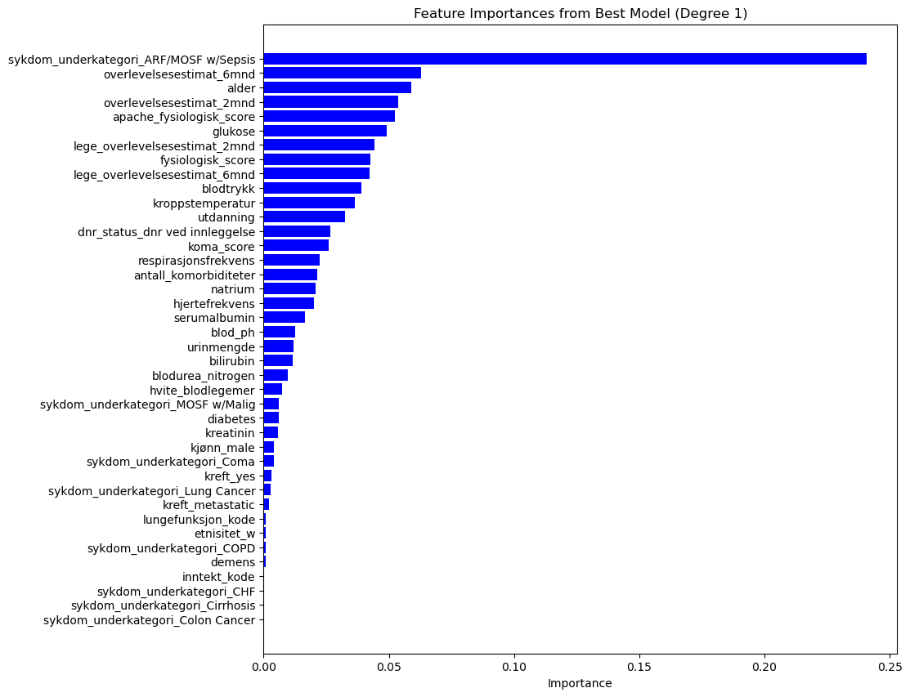

# Predicting Hospital Length of Stay

An end-to-end machine learning project using demographic, physiological, and disease-severity data from critically ill patients.

> Originally completed in 2024 as my first end-to-end data science project in INF161 at the University of Bergen. Revisited in 2026 for public documentation, reproducibility, repository hygiene, and methodological reflection.

## Overview

This project predicts hospital length of stay in days. It covers data preparation, exploratory analysis, a fixed train/validation/test split, missing-data handling, feature work, model comparison, held-out evaluation, and prediction generation.

The original analysis and its reported results are preserved. This repository is a historical portfolio project, not a clinical tool and not a new 2026 modelling study.

## Data

The analysis uses variables describing:

- patient demographics, including age, sex, education, income, and ethnicity;
- physiological measurements, including blood pressure, heart rate, respiration, temperature, and laboratory values;
- disease category, comorbidities, severity scores, and survival estimates; and
- hospital length of stay as the regression target.

The course supplied a transformed, Norwegian-labelled snapshot related to the [SUPPORT2 dataset in the UCI Machine Learning Repository](https://archive.ics.uci.edu/dataset/880/support2). The current public UCI dataset contains 9,105 patient records. The course snapshot split those IDs into 7,740 modelling records and 1,365 prediction records, but it is not a byte-for-byte copy of the public export. The audit found deliberately invalid values used in the cleaning exercise and material transformations to the DNR fields.

The patient-level course files are excluded from Git because redistribution rights for the course-specific snapshot could not be established. The related public upstream dataset is documented separately in [data/README.md](data/README.md), together with provenance, expected local paths, attribution, and reproduction limits.

## Workflow

```text
Course data snapshot
        |
        v
Cleaning, merging, and exploratory analysis
        |
        v
Fixed train / validation / test split
        |
        v
Missing-data handling and feature experiments
        |
        v
Dummy, Decision Tree, Lasso, and Gradient Boosting comparison
        |
        v
Final Gradient Boosting model
        |
        v
Held-out test evaluation and error analysis
        |
        v
Prediction generation for the course sample
```

The notebooks must be run in numerical order:

1. [Data preparation](notebooks/01_data_preparation.ipynb)
2. [Modelling](notebooks/02_modelling.ipynb)
3. [Prediction generation](notebooks/03_prediction.ipynb)

## Models and results

The original comparison included a mean-prediction `DummyRegressor`, a decision tree, Lasso regression, and gradient boosting. Root mean squared error (RMSE) was the evaluation metric, so lower values are better.

| Result | RMSE (days) |
| --- | ---: |
| Dummy baseline, validation set | 19.65 |
| Selected Gradient Boosting model, validation set | 17.59 |
| Final Gradient Boosting model, held-out test set | 16.57 |

The validation score was used during model selection. The test score was calculated once on the held-out test set after selecting the final approach. These values come from the preserved notebook outputs and the original report; the 2026 repository work did not retrain or retune the models. A fuller historical comparison is in [results/README.md](results/README.md).



*Original notebook output showing model-derived feature importance for the selected Gradient Boosting model. These values are model-specific and do not represent causal or clinical importance.*

## Error analysis

The aggregate test RMSE hides an important weakness. The model predicted typical stays much better than unusually long stays and systematically underestimated many long stays.

Among test cases with an absolute error greater than 30 days, the median actual stay was about 69 days while the median prediction was about 23.85 days. This is a substantial limitation, not evidence of clinical usefulness.

## Key findings

- Gradient Boosting produced the lowest validation RMSE among the tested approaches.
- Removing the selected training-set outliers improved the reported Gradient Boosting validation RMSE from 17.83 to 17.59.
- Handcrafted heart and lung scores did not outperform the final selected configuration.
- Model-derived feature importance highlighted disease subgroup and several prognosis, demographic, and physiological variables. These values describe the fitted model only; they do not establish clinical or causal importance.

## Limitations

- Performance is too weak and uneven for clinical use.
- Long hospital stays are poorly predicted and often substantially underestimated.
- The missing-data procedure is complex and is not encapsulated in a fitted preprocessing pipeline.
- Validation relies on one fixed validation set rather than a more robust cross-validation design for the complete selection workflow.
- Rare target values were filtered before the data split. This target-dependent preprocessing can bias the evaluation and would now be avoided.
- Several handcrafted features and clinical thresholds have limited methodological or clinical justification.
- Dummy encoding was performed separately for modelling and prediction data, which assumes compatible categories.
- Some preprocessing transformations were fitted separately to train, validation, and test data during feature experiments.
- Feature importance is model-specific and is not causal inference.

## Revisited in 2026

The modelling, historical notebook outputs, and reported metrics were intentionally preserved. The 2026 revisit focuses on clear repository structure, relative paths, dependency documentation, data-publication safety, and a more candid interpretation of the work.

If I designed the study now, I would put preprocessing and imputation in fitted pipelines, avoid target-dependent filtering before the split, use more robust model-selection procedures, separate exploratory decisions more strictly from final evaluation, and interpret model-derived feature importance more cautiously. Those changes could alter the results, so they are documented here rather than retroactively applied to the original project.

## Repository structure

```text
.
├── README.md
├── LICENSE
├── requirements.txt
├── data/
│   └── README.md
├── notebooks/
│   ├── 01_data_preparation.ipynb
│   ├── 02_modelling.ipynb
│   └── 03_prediction.ipynb
├── report/
│   └── inf161_project_report.pdf
└── results/
    ├── README.md
    └── figures/
        └── gradient-boosting-feature-importance.png
```

Local course data, processed splits, serialized models, and generated predictions are intentionally ignored and do not appear in the public tree.

## Reproduction

Python 3.12 is recommended for the current preserved environment.

```bash
python3.12 -m venv .venv
source .venv/bin/activate
python -m pip install --upgrade pip
python -m pip install -r requirements.txt
jupyter lab
```

Before running the notebooks, place the original course-distributed files in the paths listed in [data/README.md](data/README.md). Then run the notebooks in numerical order.

The repository is structurally reproducible for the owner who has that snapshot. It is not fully reproducible from the public UCI CSV alone because the course version used a different schema, a withheld-target prediction partition, and modified values. The serialized model is also excluded because it is a generated, version-sensitive pickle artifact.

## Original report

The full original report is available in Norwegian: [INF161 project report](report/inf161_project_report.pdf). It is preserved unchanged as a historical artifact.

## License

Source code and repository-authored documentation are released under the [MIT License](LICENSE). The original 2024 project report is included as a historical artifact and is not covered by that license. The license also does not apply to SUPPORT2 data or course-provided material. No University of Bergen assignment specification, rubric, or grading material is included.
