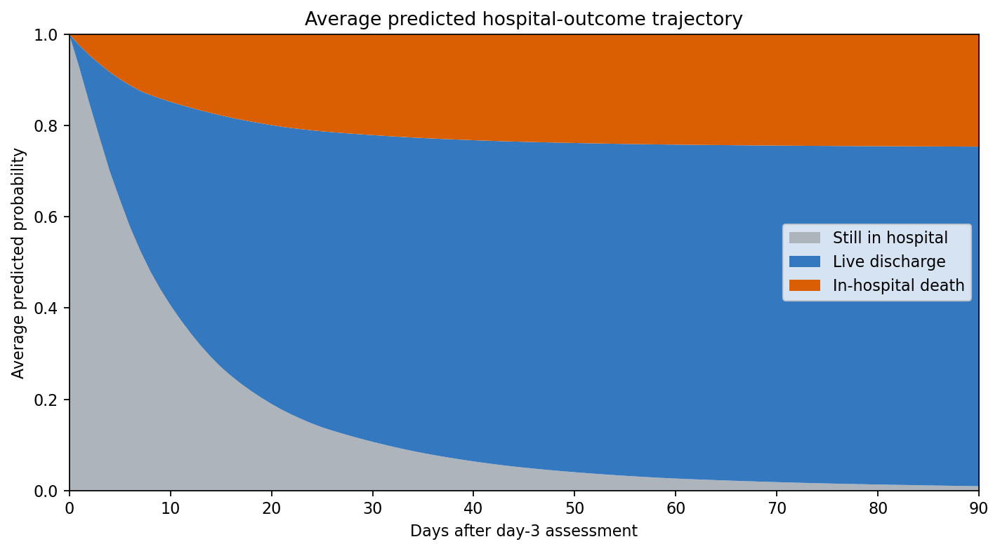
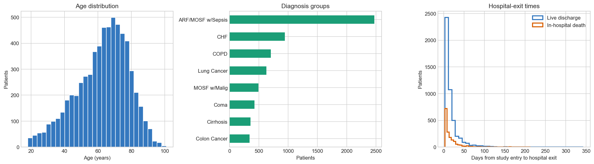
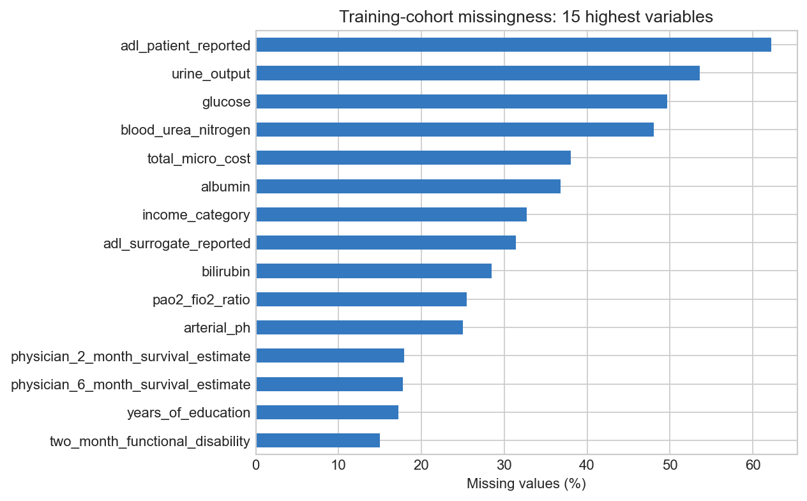
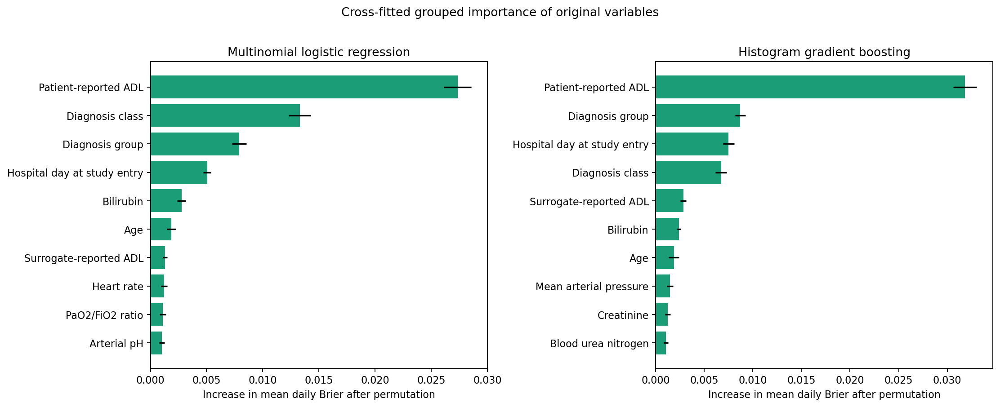
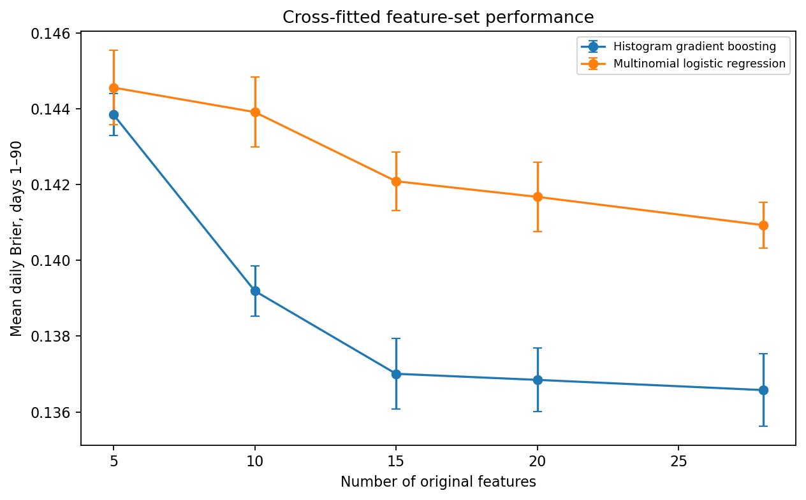
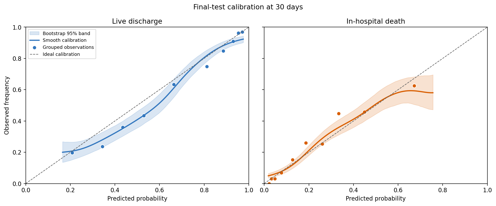
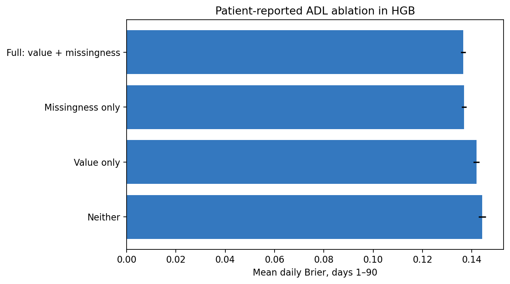
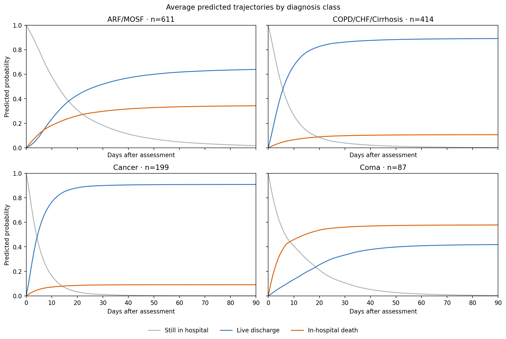
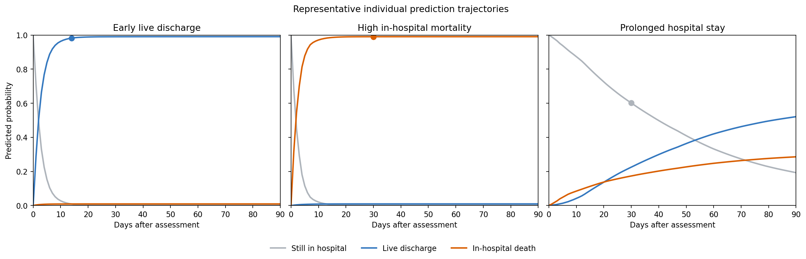

# Predicting competing hospital outcomes after the day-3 SUPPORT assessment

## A discrete-time Medical Data Science analysis of live discharge and in-hospital death

Kris-Joakim Buttedal-Fyllingen · Technical Report · September 2026

## 1. Executive summary

Ordinary length-of-stay regression cannot distinguish a stay ending in live discharge from one ending in in-hospital death. This project treats them as competing outcomes and estimates their cumulative probabilities over 90 days after the third SUPPORT study day. The remaining probability represents continued hospitalisation.

The analysis uses the 9,105-patient SUPPORT2 dataset and a fixed day-3 landmark, including only patients whose recorded hospital exit occurs after that day. The eligible cohorts contain 6,140 training, 1,307 validation, and 1,311 held-out test patients. The test set is reserved for final evaluation.

Multinomial logistic regression is compared with histogram gradient boosting (HGB), using mean daily Brier over days 1–90 as the primary model-selection metric. Lower scores mean more accurate probabilities. The completed 15-feature HGB model achieves validation Brier 0.13142, compared with 0.13419 for logistic regression using all 28 eligible predictors. Its 0.00277 advantage exceeds the prespecified practical margin of 0.002.

On the held-out test set, HGB reduces mean daily Brier relative to the patient-independent population reference by 30.4% for live discharge (95% bootstrap CI 26.6–34.1%) and 22.3% for in-hospital death (95% CI 17.9–26.7%). However, live-discharge probabilities are systematically too high on average at 30 days: calibration-in-the-large is −0.287 (95% CI −0.426 to −0.139), despite calibration slopes close to one for both outcomes.

Most of the predictive gain associated with patient-reported activities of daily living (ADL) comes from its explicit missingness indicator under the chosen imputation scheme. This may reflect patient state or documentation practices; the analysis cannot establish why. The project is an internally validated historical analysis, not a clinical tool.

## 2. Why this prediction problem is not ordinary length of stay

A conventional length-of-stay target records a single number: the time between admission and hospital exit. That number does not reveal how the stay ended. A 10-day stay followed by live discharge and a 10-day stay ending in hospital death have the same numerical length but represent different outcomes. Collapsing them into one regression target would force a model to describe two distinct clinical paths with one expected duration.

Treating discharge and death as two unrelated binary predictions would not solve the problem. Independently fitted event probabilities could add to more than one, or both could imply that a patient has already left hospital while still assigning substantial probability to a later hospital exit. The outcomes compete: once one occurs, the other cannot occur during that hospital stay.

The analysis instead tracks three mutually exclusive states after the prediction landmark:

1. still in hospital;
2. discharged alive by a given day;
3. died in hospital by that day.

These three probabilities sum to one for every patient and follow-up day.

This formulation changes the research question. The task is not to guess one exit date. It is to estimate how probability moves over time from continued hospitalisation into two terminal outcomes. A patient can initially have high probability of remaining in hospital, then accumulate discharge and mortality probability at different rates as follow-up continues.

The population reference estimates daily event probabilities from the fitting cohort, using the same patients still in hospital as the risk set for both discharge and death. Let \(t\) count days after the landmark, \(n_t\) be the number still in hospital at the beginning of day \(t\), and \(d_D(t)\) and \(d_M(t)\) be the numbers discharged alive and dying in hospital on that day. For \(n_t>0\),

\[
\hat p_D(t)=\frac{d_D(t)}{n_t}, \qquad
\hat p_M(t)=\frac{d_M(t)}{n_t}.
\]

The remaining daily probability represents continued hospitalisation:

\[
\hat p_0(t)=1-\hat p_D(t)-\hat p_M(t).
\]

These daily probabilities pass through the same cumulative competing-event recursion described in Section 5. This is the discrete-time Aalen–Johansen estimator of cumulative incidence ([1](https://doi.org/10.1002/sim.2712)). It uses no patient features: every patient being evaluated receives the same discharge and death trajectories. The modelling question is whether individual patient information improves on these population probabilities.

*Figure 1. Average predicted probability allocation in the held-out test cohort. Probability moves from continued hospitalisation into live discharge and in-hospital death while total mass remains one. The figure describes model output, not causal disease progression.*

## 3. Data and prediction landmark

SUPPORT enrolled adults with serious illness at five US teaching hospitals ([2](https://pubmed.ncbi.nlm.nih.gov/7474243/)). The SUPPORT2 dataset ([3](https://archive.ics.uci.edu/dataset/880/support2)) contains 9,105 patients and 48 fields covering demographics, diagnoses, physiological measurements, functional status, outcomes, care processes, resource use, and pre-existing prognostic estimates. The data are retrieved from UCI with `fetch_ucirepo(id=880)`. Structural checks confirm the dataset identity, dimensions, expected source columns, unique patient identifiers, and hospital-exit-time range before analysis begins.

The prediction point is the third SUPPORT study day. This is a landmark design: the model asks what will happen after a defined assessment point among patients who are still in hospital. It does not attempt admission-time prediction. The landmark also determines which information may enter the model and which patients belong to the target population.

The same-day rule is deliberately conservative. Hospital exits recorded on day 3 are excluded because the public table records days rather than exact timestamps. It is therefore not possible to establish whether the day-3 assessment preceded a same-day discharge or death. Retaining such patients could allow information recorded after the endpoint to appear as if it were a predictor. Requiring hospital exit after day 3 avoids that ordering ambiguity.

A fixed patient-level split assigns 70% of the full dataset to training and 15% each to validation and test before application of the landmark rule. After the rule, the analysis includes:

| Cohort | Eligible patients | Responsibility |
| --- | ---: | --- |
| Training | 6,140 | Exploration, tuning, feature ranking, and simplification |
| Validation | 1,307 | Comparison of completed candidate pipelines |
| Held-out test | 1,311 | Final performance, calibration, and descriptive model behaviour |

This separation protects the scientific roles of the three cohorts. Five patient-level folds within training support development. All patient-day rows from one person remain in the same fold. Validation chooses between completed logistic and HGB pipelines. The held-out test set contributes only after the model family, features, preprocessing, and hyperparameters have been locked.

*Figure 2. Age, diagnosis groups, and hospital-exit times in the training cohort before landmark exclusions. Exit times are measured from study entry.*

## 4. Predictor design and missing data

Predictor eligibility asks whether a variable may legitimately enter development; it does not assert that the variable is useful. Twenty of the 48 recorded fields are excluded because they identify patients, define the endpoint or follow-up, describe later outcomes or resource use, contain problematic care-process timing, or encode existing constructed prognostic information outside the project scope. The resulting candidate pool has 28 original predictors: 20 numeric and 8 categorical.

The pool includes age, education, comorbidity count, hospital day at study entry, physiological and laboratory measurements, two ADL measurements, sex, race, income, diagnostic grouping, diabetes, dementia, and cancer status. Race, education, and income are included as baseline sociodemographic candidates by project design. Available source metadata do not establish exact collection timing for all three, which remains a limitation rather than a reason to invent certainty.

Missing data are not a minor implementation detail in SUPPORT2. Several laboratory and functional-status fields are incomplete, and the probability that a value is missing may be related to whether a measurement was feasible, clinically prioritised, documented, or requested. Ignoring incomplete variables would discard potentially relevant information; complete-case analysis would also change the cohort in a variable-dependent way.

*Figure 3. The 15 fields with the most missing data in the training cohort before landmark exclusions. This overview includes fields excluded from prediction.*

Numeric variables receive median imputation fitted within the relevant training data. Separate missingness indicators record whether each eligible numeric value was originally absent. Categorical variables receive an explicit `Missing` level and one-hot encoding that safely handles categories not observed during fitting. Every transformation is learned inside its training fold or final fitting cohort, not from the data on which predictions are assessed.

Preprocessing is model-specific without changing the underlying predictor information. Logistic regression standardises imputed numeric values because an L2 penalty depends on scale. HGB retains the original numeric scale because its tree splits do not require standardisation. This avoids forcing the tree model through a transformation needed only by the linear model.

The missingness indicators begin as a defensible preprocessing choice. Their importance becomes an analytical finding when patient-reported ADL proves highly influential and an ablation shows that its explicit missingness flag carries much of the associated predictive gain. Section 10 examines that result separately.

## 5. Modelling the competing events in discrete time

The patient-level cohort is expanded into patient-day rows after fold assignment. Each patient contributes one row for every follow-up day on which that person is at risk, beginning the day after the landmark and ending at hospital exit or the 90-day horizon. Static patient predictors are repeated across those rows, while a scaled time term and its square allow the daily event probabilities to change over follow-up.

The target for each patient-day is:

- 0: continued hospitalisation;
- 1: live discharge on that day;
- 2: in-hospital death on that day.

The classifier predicts what happens on day \(t\), conditional on the patient still being in hospital at the beginning of that day. Write these daily probabilities as \(p_0(t)\), \(p_D(t)\), and \(p_M(t)\). They sum to one, but they are not yet the probabilities of having experienced an event by day \(t\).

To obtain those cumulative probabilities, let \(S_{t-1}\) be the probability of still being in hospital before day \(t\), and let \(F_D(t)\) and \(F_M(t)\) be the probabilities of having been discharged alive or having died in hospital by the end of day \(t\). Starting from \(S_0=1\) and \(F_D(0)=F_M(0)=0\), the update is

\[
F_k(t)=F_k(t-1)+S_{t-1}p_k(t), \qquad k\in\{D,M\},
\]

\[
S_t=S_{t-1}p_0(t).
\]

Each day's added event probability is weighted by the probability of having remained in hospital until that day. Patients who have already left hospital therefore contribute no probability to a later exit. The cumulative event probabilities can only increase, and for every follow-up day,

\[
S_t+F_D(t)+F_M(t)=1.
\]

Multinomial logistic regression is a useful reference because it imposes an additive structure on the encoded predictors. Its strengths are conceptual simplicity, stable regularisation, and a direct test of whether a relatively simple probability surface is adequate. It does not automatically represent thresholds, interactions, or other nonlinear clinical relationships.

HGB addresses those restrictions through sequentially fitted decision trees ([4](https://scikit-learn.org/stable/modules/ensemble.html#histogram-based-gradient-boosting)). Its value here is not that it is more advanced, but that it tests a specific hypothesis: interactions and nonlinearities may improve competing-event probabilities beyond an additive model. The comparison is fair because both models use the same cohort, endpoint, horizons, folds, original candidate variables, and daily-to-cumulative recursion.

Mean daily Brier over days 1–90 is the primary development metric. It measures the numerical accuracy of the predicted cumulative probabilities, using a separate Brier calculation for each event ([5](https://doi.org/10.1097/EDE.0b013e3181c30fb2)):

\[
BS_k(t)=\frac{1}{N}\sum_{i=1}^{N}\left(\hat F_{ik}(t)-Y_{ik}(t)\right)^2.
\]

Here, \(N\) is the number of patients being evaluated, \(k\) is live discharge or in-hospital death, and \(\hat F_{ik}(t)\) is the predicted cumulative probability of that event for patient \(i\) by day \(t\). The observed indicator \(Y_{ik}(t)\) equals 1 if that event has occurred by then and 0 otherwise. A competing event therefore counts as 0 for the event being scored.

The project computes this error for each follow-up day, averages over days 1–90 separately for discharge and death, and then averages the two event-specific results:

\[
\text{Mean daily Brier}=\frac{1}{2T}\sum_{k\in\{D,M\}}\sum_{t=1}^{T}BS_k(t), \qquad T=90.
\]

A score of 0 represents perfect probability predictions; larger values mean greater disagreement between predictions and observed outcomes. This suits the project's aim of estimating reliable probabilities over time. AUC mainly measures discrimination, or how well patients are ranked, whereas Brier evaluates the numerical quality of their predicted probabilities. Calibration is examined separately because a good overall Brier score does not guarantee agreement at every probability level.

## 6. Development strategy

Model development follows a short sequence designed before final testing:

1. benchmark both models with all 28 eligible predictors;
2. perform moderate model-specific tuning in five patient-level folds;
3. assess model-specific feature simplification with cross-fitted grouped permutation importance;
4. retune only the strongest settings when simplification changes the feature set;
5. compare the completed candidates on validation;
6. lock the chosen specification;
7. evaluate it once on the held-out test set.

The tuning spaces are intentionally moderate. Logistic regression searches six log-scaled values of `C`. HGB uses 12 explicit combinations of learning rate, leaf count, iteration count, L2 regularisation, and minimum leaf size. A large Cartesian search would consume substantially more computation while making the analysis harder to explain and increasing the chance of selecting a configuration for a small cross-validation fluctuation. The purpose is to identify sensible model complexity, not to exhaust every combination.

With all 28 features, the best tuned HGB score is 0.13658 and the best logistic score is 0.14093. For logistic regression, `C` controls the inverse strength of regularisation: larger values apply a weaker penalty. `C=100` is the best tested value, but its improvement over the next-best setting is less than 0.00004. This difference is negligible, so there is little evidence that testing even larger values would materially improve performance.

Feature simplification asks: does the model actually need each eligible predictor to maintain predictive performance? Permutation importance shuffles one variable and measures how much Brier error increases, indicating how much the fitted model relied on that information ([6](https://scikit-learn.org/stable/modules/permutation_importance.html)). Here, shuffling takes place at the original patient-variable level before preprocessing. All one-hot columns and the corresponding missingness indicator remain grouped with their original feature. The result describes model reliance for prediction, not a causal effect.

*Figure 4. The ten highest-ranked original predictors for each model. Importance is the increase in mean daily Brier after shuffling; error bars show standard errors across the recorded fold and permutation-repeat estimates.*

Cross-fitted feature selection keeps the data used to rank predictors separate from the data used to evaluate the resulting feature subsets. Within each training fold, an internal 80/20 split provides separate patients for fitting the ranking model and measuring permutation importance. Models using the top 5, 10, 15, 20, or all 28 predictors are then fitted using all patients in that training fold and evaluated on its held-out fold. Hyperparameters remain fixed during this comparison to isolate the effect of feature-set size.

The one-standard-error rule favours simplicity by choosing the smallest feature set whose mean cross-validation Brier is no more than one standard error above the best observed mean, using the standard error of that best result.

This rule retains all 28 features for logistic regression and 15 for HGB. Cross-fitted mean daily Brier is 0.14093 for the 28-feature logistic model and 0.13701 for the 15-feature HGB model. Permutation importance is then averaged across folds and repeats to rank predictors for each candidate’s fixed feature set. Limited retuning of the three strongest HGB configurations retains the original optimum and yields approximately 0.13661. HGB therefore removes almost half of the original predictors with no meaningful loss relative to its all-feature development result.

*Figure 5. Mean daily Brier across cross-fitted feature-count assessments. Error bars show standard errors across the five patient-level folds. HGB reaches a broad performance plateau from 15 features, while logistic regression retains all 28 under the same selection rule.*

## 7. Model selection

Cross-validation develops the candidate pipelines; validation compares the completed candidates; the held-out test set evaluates the locked choice. The completed pipelines are fitted on the full training cohort and evaluated on validation. Model selection uses validation mean daily Brier and a prespecified 0.002 practical-performance margin. The 0.002 margin was chosen pragmatically before validation as a small tolerance for differences unlikely to justify additional model complexity; it is not a clinically established minimum important difference. If the candidates had differed by less than that margin, the simpler pipeline could have been preferred when the predictive difference was negligible.

| Candidate | Original features | Validation mean daily Brier |
| --- | ---: | ---: |
| Histogram gradient boosting | 15 | 0.13142 |
| Multinomial logistic regression | 28 | 0.13419 |

HGB improves on logistic regression by 0.00277, which exceeds the practical margin. HGB is therefore selected directly rather than through a simplicity tie-break.

The locked HGB specification uses learning rate 0.05, 15 maximum leaf nodes, 200 iterations, minimum samples per leaf 50, and L2 regularisation 10. Its 15 original features are patient-reported ADL, diagnosis group, hospital day at study entry, diagnosis class, surrogate-reported ADL, bilirubin, age, mean arterial pressure, creatinine, blood urea nitrogen, heart rate, PaO2/FiO2 ratio, urine output, glucose, and arterial pH. Hyperparameters, preprocessing inputs, and features are then frozen for final evaluation.

## 8. Final test performance

The selected pipeline is refitted using training plus validation and evaluated on the held-out test set. The population reference is estimated from the same development data and assigns one discharge and death trajectory to every test patient. This comparison isolates the value of patient-specific predictors beyond overall event timing in the development population.

| Outcome | Model mean daily Brier | 95% model CI | Population reference |
| --- | ---: | ---: | ---: |
| Live discharge | 0.15026 | 0.14188–0.15907 | 0.21598 |
| In-hospital death | 0.13433 | 0.12464–0.14482 | 0.17298 |

Two thousand paired patient-level bootstrap samples quantify uncertainty from the finite test cohort. Each replicate samples patients with replacement and evaluates both the model and population reference on the same sampled positions. The Brier difference is recalculated on each resample, keeping the fitted predictions fixed. In the report, improvement is defined as

\[
\text{improvement}=\text{Brier}_{\text{population}}-\text{Brier}_{\text{HGB}},
\]

so positive values favour HGB.

| Outcome | Absolute Brier improvement | Relative Brier reduction |
| --- | ---: | ---: |
| Live discharge | 0.06572 (95% CI 0.05698–0.07465) | 30.4% (26.6–34.1%) |
| In-hospital death | 0.03865 (95% CI 0.02995–0.04775) | 22.3% (17.9–26.7%) |

The intervals describe how results vary when test patients are resampled. Both improvement intervals remain above zero, suggesting that the advantage is reasonably stable to changes in the test sample and is unlikely to depend on only a few unusual patients. They do not include uncertainty from repeating the entire development process, choosing another split, or applying the model in a new healthcare system.

AUC provides a secondary view of discrimination. It remains above 0.81 for both outcomes at every reported horizon:

| Days after assessment | Live-discharge AUC | Death AUC |
| ---: | ---: | ---: |
| 7 | 0.835 | 0.823 |
| 14 | 0.842 | 0.816 |
| 30 | 0.848 | 0.820 |
| 60 | 0.830 | 0.814 |
| 90 | 0.827 | 0.818 |

These AUC values show useful ranking, but they are not the headline result. The project aims to estimate probabilities over time, so overall probability error and calibration remain essential.

## 9. Calibration: where the model is and is not trustworthy

Calibration asks whether predicted probability levels correspond to observed event frequencies ([7](https://doi.org/10.1186/s12916-019-1466-7)). Three views answer related but different questions. Calibration-in-the-large measures systematic average over- or underprediction. The calibration slope assesses whether predictions vary too strongly or not strongly enough across patients. The smooth calibration curve examines local agreement across the observed prediction range.

| Outcome at 30 days | Calibration-in-the-large | Calibration slope |
| --- | ---: | ---: |
| Live discharge | −0.287 (95% CI −0.426 to −0.139) | 1.021 (0.916–1.145) |
| In-hospital death | 0.092 (95% CI −0.062 to 0.244) | 0.984 (0.865–1.124) |

For live discharge, the slope is close to one, so the spread between lower and higher predictions is broadly reasonable. The negative calibration-in-the-large and its interval show a separate problem: predicted discharge probabilities are systematically too high on average at 30 days. A slope close to one does not remove the average overprediction shown by calibration-in-the-large. The model should therefore not be described as simply well calibrated.

For in-hospital death, calibration-in-the-large is closer to zero and its interval includes zero. The slope is also close to one. Global calibration is therefore closer to the ideal values for this outcome, although that does not guarantee local agreement at every probability level.

The smooth curves make the distinction visible. The live-discharge curve lies below the ideal line through much of its populated range, consistent with average overprediction. The death curve follows the ideal line reasonably through much of the central range but departs at higher predictions. Bootstrap bands widen where observations are sparse, so tail behaviour should not be over-interpreted. Grouped points support interpretation but do not replace the continuous curve.

*Figure 6. Thirty-day calibration in the held-out test set. Curves show Gaussian-kernel smoothing, shaded areas show 95% patient-bootstrap bands, points show grouped observed frequencies, and dashed lines show ideal calibration.*

This section also explains why AUC cannot stand alone. A model can rank patients correctly while assigning probabilities that are systematically too high. For decisions that depend on probability magnitude, that difference matters.

## 10. What did the model learn from ADL?

Activities of Daily Living (ADL) describes basic functional ability in everyday activities. SUPPORT2 records a patient-reported measure and a separate surrogate-reported measure, provided by someone reporting on the patient’s behalf ([8](https://hbiostat.org/data/repo/csupport2)).

Patient-reported ADL has the largest grouped permutation importance for both model families. That result could arise from the recorded values, from the fact that a value is missing, or from both. An ablation analysis removes or retains individual input components to examine which parts contribute to predictive performance. This comparison uses the all-feature HGB development model and holds folds, HGB settings, other predictors (including surrogate-reported ADL), and other preprocessing choices fixed. The four conditions retain the ADL value and its explicit missingness indicator, the indicator alone, the value alone, or neither.

| Patient-reported ADL condition | Mean daily Brier | Fold SD |
| --- | ---: | ---: |
| Value + explicit missingness indicator | 0.13658 | 0.00213 |
| Missingness indicator only | 0.13690 | 0.00213 |
| Value only | 0.14191 | 0.00267 |
| Neither | 0.14419 | 0.00323 |

The full condition performs best, but retaining only the explicit missingness indicator produces a very similar score. Retaining the value without its indicator is substantially worse, while removing both performs worst. The appropriate conclusion is that the explicit missingness indicator accounts for most of the predictive gain associated with patient-reported ADL under the chosen median-imputation scheme.

This is not a perfect decomposition of “value information” and “missingness information.” In the value-only condition, absent ADL observations are still median-imputed. Removing the explicit indicator therefore does not guarantee that all information associated with missingness disappears from the transformed value distribution. The comparison therefore shows the contribution of an explicit missingness flag under this preprocessing scheme, rather than fully separating the two types of information.

*Figure 7. Five-fold development performance under four patient-reported ADL representations. Error bars show standard errors across folds. All other candidate features and preprocessing choices remain fixed.*

Several explanations are plausible but untested. Missing patient-reported ADL may reflect inability to respond, severity that prevents assessment, documentation workflow, clinical prioritisation, or site-specific practice. None is established by this analysis. The indicator is predictive evidence about the dataset and the recording process, not evidence that missingness causes a hospital outcome.

The transportability implication is important. Biological relationships may remain similar across hospitals while documentation processes differ. A model that relies strongly on whether an assessment was recorded can lose accuracy or change calibration after transfer to a system with different staffing, forms, measurement protocols, or patient populations. External validation must therefore examine not only outcome performance but also the meaning and frequency of missingness.

## 11. Discussion

The main contribution of the project is its formulation rather than a complicated algorithm. A single length-of-stay regression would hide the distinction between live discharge and in-hospital death. Independent binary probabilities could be incoherent. The discrete-time competing-event structure instead produces one probability distribution over continued hospitalisation and two mutually exclusive exit types. This makes the output interpretable at every follow-up day.

The model comparison supports a modest improvement from nonlinear flexibility. HGB performs better during development and validation, with the validation advantage exceeding the prespecified practical margin. Logistic regression remains informative as a simpler reference. The conclusion is not that linear models are inadequate in general. It is that nonlinearities and interactions add useful probability accuracy for this specific task and dataset.

Feature simplification improves the final pipeline’s focus. HGB retains 15 of the 28 eligible original predictors without meaningful development loss. The process does not claim that excluded candidates are clinically irrelevant. It shows that, given the other retained variables and the fitted HGB structure, the reduced set is sufficient for the observed predictive performance. Grouped permutation importance remains model-dependent and can be affected by correlation between variables.

The held-out results provide stronger evidence than a development score alone. Patient-specific HGB predictions reduce mean daily Brier relative to the population reference for both outcomes. Paired bootstrap intervals remain away from zero improvement, suggesting that the advantage is not driven by a small set of test patients. The evidence remains specific to one historical source population.

Calibration prevents an overly positive reading of the discrimination results. Live-discharge ranking is good at 30 days, yet the corresponding probabilities are too high on average. Ranking and probability magnitude are distinct model properties. In-hospital-death calibration is closer to ideal globally, but smooth curves still show uncertainty and local departures where observations are sparse.

The predicted trajectories illustrate why the output cannot be reduced to one risk score. Probability shifts rapidly away from continued hospitalisation early in follow-up and then accumulates more gradually. Diagnosis-class averages and mechanically selected patient examples show heterogeneous paths: some predictions are discharge-oriented, some mortality-oriented, and some retain more probability of a prolonged stay. These plots describe model behaviour rather than subgroup effects.

*Figure 8. Average predicted trajectories for diagnosis classes with at least 75 test patients. Shared axes allow descriptive comparison; these are not causal effects or subgroup-specific validation results.*

*Figure 9. Three distinct test-patient trajectories selected by prespecified model prediction rules: high early discharge probability, high death probability, and high probability of remaining in hospital. Selection does not use observed future outcomes.*

The ADL analysis adds a broader Medical Data Science lesson. Clinical datasets contain both patient information and traces of the process that produced the record. Missingness can be strongly predictive even when its mechanism is unclear. That signal may improve internal performance while increasing sensitivity to changes in documentation practice. Missing-data indicators therefore deserve both technical validation and domain scrutiny.

Taken together, the findings support a balanced interpretation. The analysis defines a coherent prediction target, shows that HGB modestly improves on an additive model, reduces the feature set, quantifies held-out uncertainty, and identifies a meaningful calibration limitation. Its strength lies in this chain of reasoning rather than in the complexity or number of models.

## 12. Limitations

SUPPORT2 is historical. Patients were enrolled in US teaching hospitals in a care context that differs from contemporary practice. A same-source random split tests internal reproducibility across patients, not transport across time, hospitals, or healthcare systems. No contemporary external validation is available.

Prediction starts after the day-3 assessment. Patients discharged or dying on or before the landmark are outside the target population, so the model does not describe admission-time risk or early hospital exits. The conservative same-day exclusion avoids ambiguous ordering but narrows the population further.

Time is discretised into days. Within-day event ordering and more granular hazard changes cannot be represented. Predictors are treated as static after the landmark, so subsequent changes in physiology, treatment, complications, or care goals are not incorporated.

Available metadata do not establish exact collection timing for every baseline sociodemographic field. The project excludes clearly post-prediction and outcome-related variables, but residual timing uncertainty remains for some eligible inputs.

Missingness may encode local measurement and documentation processes. The strong patient-reported ADL indicator could therefore behave differently elsewhere. The median-imputation ablation does not perfectly separate recorded-value information from all information related to missingness.

No fairness analysis was performed. Race, education, and income were eligible candidate predictors, but this project does not assess differential error, calibration, or consequences across demographic groups. Absence of such an analysis prevents claims about equitable performance.

The project evaluates how accurately the model predicts outcomes, but it does not test how the predictions would be used in clinical decisions or whether using them would improve patient care.

The 2,000 bootstrap replicates quantify uncertainty from resampling held-out test patients. They do not repeat feature selection, tuning, model choice, or the train/validation/test split. The intervals therefore do not represent full model-development uncertainty.

Finally, the subgroup and individual trajectory figures are descriptive views of the selected model. They do not establish causal group effects, treatment effects, subgroup-specific validity, or patient-level clinical recommendations.

## 13. Conclusion

This project reframes hospital length of stay as coherent prediction of two competing exit outcomes after a day-3 landmark. A 15-feature HGB model was selected over multinomial logistic regression and improved patient-specific probability accuracy over a population reference for both live discharge and in-hospital death. Paired bootstrap intervals support the stability of that improvement within the held-out SUPPORT2 test cohort.

The result remains qualified. Live-discharge probabilities are systematically too high on average at 30 days despite a calibration slope near one. Patient-reported ADL performance also depends strongly on an explicit missingness indicator, which may encode workflow as well as patient state. The output is an internally validated historical Medical Data Science analysis, not a clinical tool. The most meaningful next step is external, temporally relevant validation rather than adding more model complexity.

## 14. References

1. Putter H, Fiocco M, Geskus RB. Tutorial in biostatistics: competing risks and multi-state models. Statistics in Medicine. 2007;26(11):2389–2430. [doi:10.1002/sim.2712](https://doi.org/10.1002/sim.2712).

2. The SUPPORT Principal Investigators. A controlled trial to improve care for seriously ill hospitalized patients: the Study to Understand Prognoses and Preferences for Outcomes and Risks of Treatments (SUPPORT). JAMA. 1995;274(20):1591–1598. https://pubmed.ncbi.nlm.nih.gov/7474243/

3. UCI Machine Learning Repository. SUPPORT2 [dataset]. Dataset 880. https://archive.ics.uci.edu/dataset/880/support2. Accessed 17 September 2026.

4. scikit-learn developers. Histogram-based gradient boosting. scikit-learn User Guide. https://scikit-learn.org/stable/modules/ensemble.html#histogram-based-gradient-boosting. Accessed 17 September 2026.

5. Steyerberg EW, Vickers AJ, Cook NR, et al. Assessing the performance of prediction models: a framework for traditional and novel measures. Epidemiology. 2010;21(1):128–138. [doi:10.1097/EDE.0b013e3181c30fb2](https://doi.org/10.1097/EDE.0b013e3181c30fb2).

6. scikit-learn developers. Permutation feature importance. scikit-learn User Guide. https://scikit-learn.org/stable/modules/permutation_importance.html. Accessed 17 September 2026.

7. Van Calster B, McLernon DJ, van Smeden M, Wynants L, Steyerberg EW. Calibration: the Achilles heel of predictive analytics. BMC Medicine. 2019;17:230. [doi:10.1186/s12916-019-1466-7](https://doi.org/10.1186/s12916-019-1466-7).

8. Vanderbilt University Department of Biostatistics. SUPPORT2 variable labels and summary. https://hbiostat.org/data/repo/csupport2. Accessed 17 September 2026.
